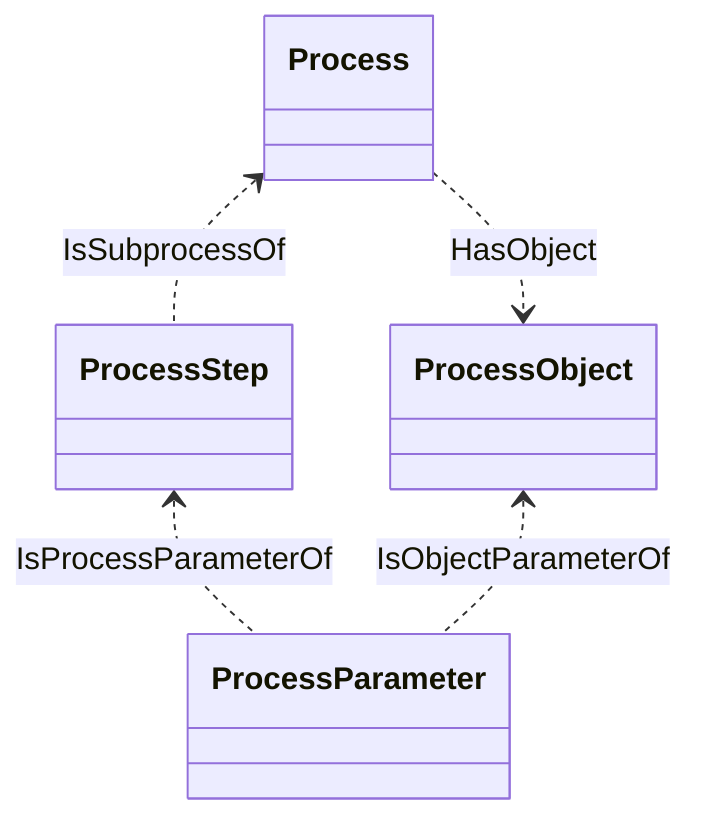
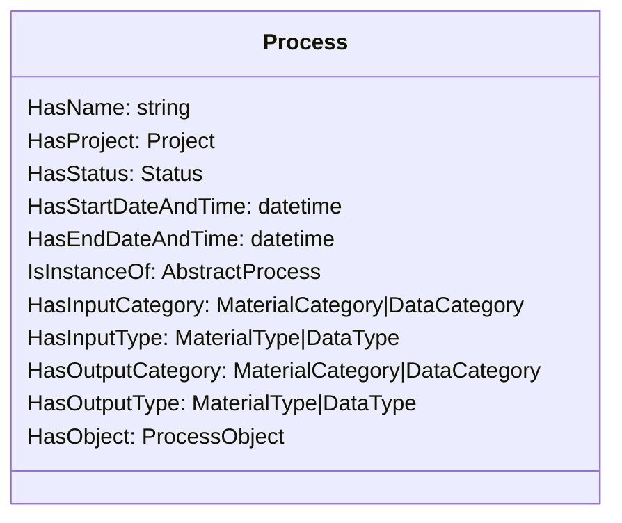
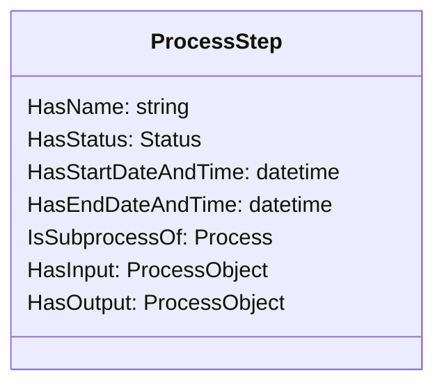
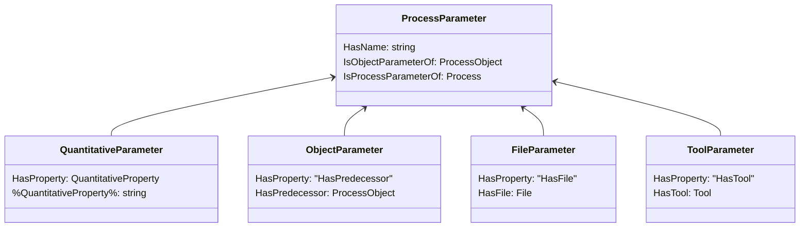

# kiprobatt-dataset
The exported dataset of kiprobatt.de

## Stats
| Metric        | Value         |
| ------------- |:-------------:|
| statements/triples | 236360
| subjects | 22590
| predicates | 43
| objects | 31285

## Data Structure Overview

### Process

### Process Step

### Process Parameter

## Important Concepts

### Materials

| IRI        | Name           | Category  | Link  |
| ------------- |:-------------:| -----:| -----:|
| Category:OSL905ace803972428ab2ad53d04c87624e | Feststoff | Material | [url](https://kiprobatt.de/id/Category:OSL905ace803972428ab2ad53d04c87624e)
| Category:OSLa24dc426cfb44c8a93c18e176147c593 | Separatorfolie | Batteriekomponente | [url](https://kiprobatt.de/id/Category:OSLa24dc426cfb44c8a93c18e176147c593)
| Category:OSL5167a01255564bac94872a612fae691e | Salz | Feststoff | [url](https://kiprobatt.de/id/Category:OSL5167a01255564bac94872a612fae691e)
| Category:OSL7dae82e0b8cd4dfbb38b58255ff63852 | Electrode stack | Batteriekomponente | [url](https://kiprobatt.de/id/Category:OSL7dae82e0b8cd4dfbb38b58255ff63852)
| Category:OSL2ddfdff7e0a44cd7b0988e5c9fbc5070 | Stromableiter-Tabs | Batteriekomponente | [url](https://kiprobatt.de/id/Category:OSL2ddfdff7e0a44cd7b0988e5c9fbc5070)
| Category:OSL1d150a0020684ae6b04ef352e3e96975 | Pouchfolie | Batteriekomponente | [url](https://kiprobatt.de/id/Category:OSL1d150a0020684ae6b04ef352e3e96975)
| Category:OSL7aa7784eb4d34192b568ce73daf74a7e | Formated cell | Batteriezelle | [url](https://kiprobatt.de/id/Category:OSL7aa7784eb4d34192b568ce73daf74a7e)
| Category:OSLd50f9bf0b5d44709b34ffe36b550031b | Flüssigkeit | Material | [url](https://kiprobatt.de/id/Category:OSLd50f9bf0b5d44709b34ffe36b550031b)
| Category:OSLd83db70a5bf746fb9126d84eb9f6366d | Filled cell | Batteriezelle | [url](https://kiprobatt.de/id/Category:OSLd83db70a5bf746fb9126d84eb9f6366d)
| Category:OSL37da8604ced44553a8c9ead503144b66 | Batteriekomponente | Material | [url](https://kiprobatt.de/id/Category:OSL37da8604ced44553a8c9ead503144b66)
| Category:OSL33ebe0d5b26d443cb7a52563e08cea92 | Cycled cell | Batteriezelle | [url](https://kiprobatt.de/id/Category:OSL33ebe0d5b26d443cb7a52563e08cea92)
| Category:OSLb7c845da94fd460786b51750a7060b2b | Kathode | Elektrode | [url](https://kiprobatt.de/id/Category:OSLb7c845da94fd460786b51750a7060b2b)
| Category:OSL4d8cada9104c49caa38dfef384210245 | Elektrode | Batteriekomponente | [url](https://kiprobatt.de/id/Category:OSL4d8cada9104c49caa38dfef384210245)
| Category:OSLa8f80efb5199429cb58989c5a5558304 | Batteriezelle | Material | [url](https://kiprobatt.de/id/Category:OSLa8f80efb5199429cb58989c5a5558304)
| Category:OSL592dc7f88ff14cf28f1cf61420749bfe | Anodenfolie | Elektrodenfolie | [url](https://kiprobatt.de/id/Category:OSL592dc7f88ff14cf28f1cf61420749bfe)
| Category:OSLb1415173552d4921acf30ac51f3bce62 | Elektrodenmagazin | Batteriekomponente | [url](https://kiprobatt.de/id/Category:OSLb1415173552d4921acf30ac51f3bce62)
| Category:OSLb3049eb1d23048c78d82ec6b3a08168a | Dried electrode magazin | Batteriekomponente | [url](https://kiprobatt.de/id/Category:OSLb3049eb1d23048c78d82ec6b3a08168a)
| Category:OSLf034e81cd50d4e9ba8e9e31215d39ff0 | Dry cell | Batteriezelle | [url](https://kiprobatt.de/id/Category:OSLf034e81cd50d4e9ba8e9e31215d39ff0)
| Category:OSL2fcb7627b67a4104bb4c1ed30a11329a | Anode | Elektrode | [url](https://kiprobatt.de/id/Category:OSL2fcb7627b67a4104bb4c1ed30a11329a)
| Category:OSL81ff062158d44f839d30430012a1a8e5 | Elektrodenfolie | Batteriekomponente | [url](https://kiprobatt.de/id/Category:OSL81ff062158d44f839d30430012a1a8e5)
| Category:OSLfd9941a61639408b9426ba07bd4ee0fd | Degassed cell | Formated cell | [url](https://kiprobatt.de/id/Category:OSLfd9941a61639408b9426ba07bd4ee0fd)
| Category:OSLd6b549f7822949c29a3d4e48f96513d8 | Kathodenfolie | Elektrodenfolie | [url](https://kiprobatt.de/id/Category:OSLd6b549f7822949c29a3d4e48f96513d8)
| Category:OSL0cdd7b45aa6a47fdbf8ca9e7ddc06531 | Elektrolyt | Flüssigkeit | [url](https://kiprobatt.de/id/Category:OSL0cdd7b45aa6a47fdbf8ca9e7ddc06531)
| Category:OSL3d9c769aeddb4aa58fad3e742bc65adb | Test | Feststoff | [url](https://kiprobatt.de/id/Category:OSL3d9c769aeddb4aa58fad3e742bc65adb)

### Material Types
| IRI        | Name           | Link  |
| ------------- |:-------------:| -----:|
| Material:OSL1818619f26d24571a6a652a596e118eb | Dried cathode magazin (Common) | [url](https://kiprobatt.de/id/Material:OSL1818619f26d24571a6a652a596e118eb)
| Material:OSLd14c860458ea4b9aaf93a4bf64838ac7 | Cell (KIproBatt v1) | [url](https://kiprobatt.de/id/Material:OSLd14c860458ea4b9aaf93a4bf64838ac7)
| Material:OSLbe31a19a3a134e249e5435a074757597 | Filled cell (KIproBatt v1) | [url](https://kiprobatt.de/id/Material:OSLbe31a19a3a134e249e5435a074757597)
| Material:OSLb1f6c2c24d884a87b3e374d302eb1a80 | UC NMC622 3.1 mAh/cm² | [url](https://kiprobatt.de/id/Material:OSLb1f6c2c24d884a87b3e374d302eb1a80)
| Material:OSLa8ec7bb1ae5d4b52997d12e780ca5833 | Elektrodenmagazin (Allgemein) | [url](https://kiprobatt.de/id/Material:OSLa8ec7bb1ae5d4b52997d12e780ca5833)
| Material:OSL4203630bca484521b91d11be1bd04f73 | Targray Cu/Ni | [url](https://kiprobatt.de/id/Material:OSL4203630bca484521b91d11be1bd04f73)
| Material:OSLca38558a2a914feca39eb088536cc8c5 | Dried electrode magazine (Common) | [url](https://kiprobatt.de/id/Material:OSLca38558a2a914feca39eb088536cc8c5)
| Material:OSL33937f131bf645768b5cbe2be15da19a | Targray Al | [url](https://kiprobatt.de/id/Material:OSL33937f131bf645768b5cbe2be15da19a)
| Material:OSLa56701a567b64fe2a6eab5bd90f33d30 | Anode magazine (KIproBatt v1) | [url](https://kiprobatt.de/id/Material:OSLa56701a567b64fe2a6eab5bd90f33d30)
| Material:OSL833581f40da94d9bb8b4bb7c437a734d | Celgard CG2320 | [url](https://kiprobatt.de/id/Material:OSL833581f40da94d9bb8b4bb7c437a734d)
| Material:OSLb1be99ebaf8247bba8bd49e22a91afe8 | UC NMC622 3.5 mAh/cm² | [url](https://kiprobatt.de/id/Material:OSLb1be99ebaf8247bba8bd49e22a91afe8)
| Material:OSL5cf054503ea24a1eafddf18250cb6dfa | Anode magazine (KIproBatt v2) | [url](https://kiprobatt.de/id/Material:OSL5cf054503ea24a1eafddf18250cb6dfa)
| Material:OSL76643ae2095740d787b9cc7f14938502 | Elyte EC/DMC 3:7 + 2% VC | [url](https://kiprobatt.de/id/Material:OSL76643ae2095740d787b9cc7f14938502)
| Material:OSLd10cdd23be944d57a460ae9aa2ec0674 | Degassed cell (KIproBatt v1) | [url](https://kiprobatt.de/id/Material:OSLd10cdd23be944d57a460ae9aa2ec0674)
| Material:OSL344e5c0f20e04894abe53678e2f68351 | Electrode stack (KIproBatt v1) | [url](https://kiprobatt.de/id/Material:OSL344e5c0f20e04894abe53678e2f68351)
| Material:OSL7885a87a65f344f090140b92e2dae035 | Hutchinson 1.7 LFP | [url](https://kiprobatt.de/id/Material:OSL7885a87a65f344f090140b92e2dae035)
| Material:OSLa6b343604e5f4022a4a9feeef0f6adc6 | Cathode magazine (KIproBatt v2) | [url](https://kiprobatt.de/id/Material:OSLa6b343604e5f4022a4a9feeef0f6adc6)
| Material:OSLd6897689b4ab4d0abfbe73dca741de31 | Kanematsu Pouch foil | [url](https://kiprobatt.de/id/Material:OSLd6897689b4ab4d0abfbe73dca741de31)
| Material:OSL6f819ab9a80947d39b0327083e561786 | Elektrode (Allgemein) | [url](https://kiprobatt.de/id/Material:OSL6f819ab9a80947d39b0327083e561786)
| Material:OSLfd855c1891a74c20a32332e950109dbb | Dried anode magazin (Common) | [url](https://kiprobatt.de/id/Material:OSLfd855c1891a74c20a32332e950109dbb)
| Material:OSL5cede93e53054e23b6f4a18004e22c1c | Formated cell (KIproBatt v1) | [url](https://kiprobatt.de/id/Material:OSL5cede93e53054e23b6f4a18004e22c1c)
| Material:OSL35365769f21b4e408e582318a7e81a6e | Cathode magazine (KIproBatt v1) | [url](https://kiprobatt.de/id/Material:OSL35365769f21b4e408e582318a7e81a6e)
| Material:OSLe8c5465c93e64e5989b51ac0552529f2 | Dry cell (KIproBatt v1) | [url](https://kiprobatt.de/id/Material:OSLe8c5465c93e64e5989b51ac0552529f2)
| Material:OSLdc13eeda4af9442eb83900e0cedc60ae | CCI CellFill | [url](https://kiprobatt.de/id/Material:OSLdc13eeda4af9442eb83900e0cedc60ae)

### Processes
| IRI        | Name           | Link  |
| ------------- |:-------------:| -----:|
|LabProcess:OSLbc089261bd1b470c9ec5e159ce3442c6 | KIproBatt v1 Filling | [url](https://kiprobatt.de/id/LabProcess:OSLbc089261bd1b470c9ec5e159ce3442c6)
|LabProcess:OSL9a645a64b15442398ad3c057e1b64d87 | KIproBatt v1 Separation | [url](https://kiprobatt.de/id/LabProcess:OSL9a645a64b15442398ad3c057e1b64d87)
|LabProcess:OSL6d6a05be73d64293a34654c6b9b48eb0 | KIproBatt v1 Formation and EoL-Test | [url](https://kiprobatt.de/id/LabProcess:OSL6d6a05be73d64293a34654c6b9b48eb0)
|LabProcess:OSLd0c734a239844a0d8820856add12aeca | KIproBatt v1 Stacking | [url](https://kiprobatt.de/id/LabProcess:OSLd0c734a239844a0d8820856add12aeca)
|LabProcess:OSLdc7b328d2c0b4348ae5e60e2ee7b9fb8 | KIproBatt v1 Degassing | [url](https://kiprobatt.de/id/LabProcess:OSLdc7b328d2c0b4348ae5e60e2ee7b9fb8)
|LabProcess:OSL7ca64bd792e648f181b881525e621ee4 | AI Image Analysis | [url](https://kiprobatt.de/id/LabProcess:OSL7ca64bd792e648f181b881525e621ee4)
|LabProcess:OSLce4377780d0a40bb883c48d698f0b9de | KIproBatt v2 Stacking | [url](https://kiprobatt.de/id/LabProcess:OSLce4377780d0a40bb883c48d698f0b9de)
|LabProcess:OSL8d3ddce404964e89b37e6368071a822b | Electrochemical Feature Extraction | [url](https://kiprobatt.de/id/LabProcess:OSL8d3ddce404964e89b37e6368071a822b)
|LabProcess:OSLdec1088137c143a5bab6495efe873fdb | KIproBatt v2 Separation | [url](https://kiprobatt.de/id/LabProcess:OSLdec1088137c143a5bab6495efe873fdb)
|LabProcess:OSL4c1f7444e389471a8250f53407191735 | KIproBatt v1 Drying | [url](https://kiprobatt.de/id/LabProcess:OSL4c1f7444e389471a8250f53407191735)

